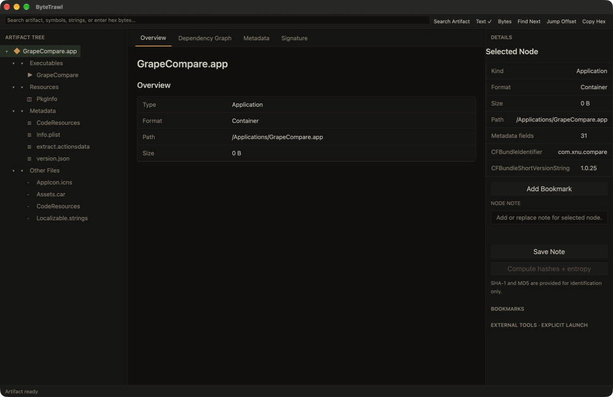

# ByteTrawl 1.0.3

[](https://github.com/everettjf/homebrew-tap/releases/tag/bytetrawl-v1.0.3)
[](#requirements)
[](LICENSE)

ByteTrawl is a cross-platform, static application and binary inspection workbench written in Rust. It treats applications, directories, packages, and individual files as logical Artifacts, then presents their structure and PE, Mach-O, or ELF details through one host-independent analysis model.

**Current release:** [ByteTrawl 1.0.3](https://github.com/everettjf/homebrew-tap/releases/tag/bytetrawl-v1.0.3) for Apple silicon Macs.

## Screenshots

[](https://xnu.app/bytetrawl/#gallery)

The live [ByteTrawl gallery](https://xnu.app/bytetrawl/#gallery) rotates through application structure, Mach-O details, dependency resolution, extracted strings, and bounded hex inspection. The screenshots were captured from ByteTrawl while statically inspecting `/Applications/GrapeCompare.app`.

## Install with Homebrew

```sh
brew tap everettjf/tap
brew install --cask bytetrawl
brew install bytetrawl-cli
```

Verify the CLI installation:

```sh
bytetrawl-cli --version
# bytetrawl-cli 1.0.3
```

The 1.0.3 app bundle is Developer ID signed, Apple-notarized, and ships with a stapled notarization ticket so Gatekeeper can verify it without contacting Apple.

## Requirements

- Apple silicon Mac (`arm64`)
- macOS 13 Ventura or later
- Homebrew for the installation commands above

The current release target is macOS. The core does not depend on GPUI and can statically inspect Windows PE and Linux ELF binaries on macOS; host-specific Windows and Linux packaging and UI validation will follow separately.

The UI ships with a warm terminal-style dark theme derived from the semantic palette used by [xnu.app](https://xnu.app): warm near-black surfaces, paper-colored text, terminal green primary actions, and amber accents. Theme colors live in one semantic token module instead of individual views.

## Build and run on macOS

```sh
cargo run -p bytetrawl
```

Build a launchable macOS application bundle:

```sh
sh scripts/build-macos-app.sh
open dist/ByteTrawl.app
```

Use **File → Open Folder** for an application bundle or directory, and **File → Open File** for a package, executable, library, metadata file, or other binary. Files and folders can also be dragged directly into the center of the window.

## CLI

`bytetrawl-cli` is an independent executable; the desktop application remains GUI-only. It writes a versioned JSON report to stdout by default, keeping diagnostics on stderr so it can be used safely in scripts.

```sh
cargo run -p bytetrawl-cli -- inspect ./SomeApp.app --pretty
cargo run -p bytetrawl-cli -- inspect ./app.exe --depth deep --output report.json
cargo run -p bytetrawl-cli -- inspect ./package --hash sha256 --strings --entropy
```

Expensive work is opt-in. `--depth standard` performs structural analysis; `--depth deep` additionally enables SHA-256, strings, entropy, signature inspection, and the dependency graph. Individual tasks can be enabled explicitly. Pressing Ctrl-C cancels through the same analysis cancellation token used by the core.

Exit codes are `0` for a complete report, `1` for a fatal error, `2` when `--fail-on` reaches the requested finding severity, `4` when cancelled, and `5` for a usable but partial report. Output files are written atomically.

Release binaries and Homebrew metadata are hosted in the public [homebrew-tap release](https://github.com/everettjf/homebrew-tap/releases/tag/bytetrawl-v1.0.3), while the source repository remains private.

## Desktop workflow

- Native macOS menus for opening files, folders, and workspaces, saving workspaces, editing text, and focusing search.
- `File → New Window` creates an independent inspection session; the native Window menu tracks open windows.
- Drag a file, application, package, workspace, or directory into the center to open it.
- Resizable Artifact Tree, inspector, and Details regions with virtualized tables for large inputs.
- A compact **External Tools…** menu shows compatible installed integrations first, distinguishes GUI launchers from captured command-line tools, and summarizes unavailable integrations without filling the Details pane with disabled buttons.
- Workspaces preserve the artifact path, selected view, bookmarks, notes, and cached analysis results.

## Implemented inspection workflow

- Logical Artifact Tree groups executables, frameworks, libraries, plugins, resources, metadata, packages, archives, and disk images independently of their physical paths.
- The Artifact Tree, global results, Strings, symbols, dependencies, graph edges, sections, segments, and relocation tables use GPUI virtual rendering, so large artifacts instantiate only rows inside the current viewport.
- A host-independent `BinaryAnalyzer` interface dispatches to concrete `PeAnalyzer`, `MachOAnalyzer`, and `ElfAnalyzer` implementations. Unified PE, Mach-O, Universal Mach-O, and ELF results expose headers, sections, imports, exports, symbols, dependencies, signatures, metadata, entropy, and inspection findings without leaking parser-specific types into the UI.
- Binary containers and ar libraries are parsed with `goblin`; PE embedded signatures with `authenticode`; Apple UDIF/DMG containers with `udif`; Apple XAR/flat PKG containers with `apple-xar`; tar streams with `tar`; XML with `quick-xml`; plists with `plist`; ZIP central directories with `zip`; file mapping with `memmap2`; and digests with the RustCrypto hash crates. ByteTrawl's own code focuses on the Artifact model, safe limits, normalization, orchestration, and UI.
- Universal Mach-O slices are parsed independently and selectable from the **Slices** tab.
- Artifact-wide dependencies are built lazily into a cancellable **Dependency Graph** list with source architecture, bundled/system/missing/unknown resolution, and resolved target paths.
- Strings include ASCII, UTF-8, UTF-16LE, UTF-16BE, file offsets, section names, and virtual addresses where mapping information exists.
- Hex inspection reads 4 KiB windows on demand and supports offset jumps, byte/text search, selection, and copy without loading the complete file into the UI.
- Hashes plus whole-file and section entropy are explicit, cancellable, cached tasks. SHA-1 and MD5 are labeled as identification-only algorithms; opening an Artifact, global search, and dependency graph construction do not eagerly hash files or calculate entropy.
- Mach-O parsing reports the embedded code-signature blob statically. Host cryptographic verification, entitlements, hardened-runtime details, and Gatekeeper/notarization assessment run in the background only when the Signature view is selected; each subprocess has a 30-second timeout and 4 MiB output limits.
- ZIP inspection reads only the central directory and reports unsafe paths, symbolic links, expansion ratio, and suspicious expanded size. It does not extract entries.
- DMG and ISO disk images are recognized from container structure rather than extension. Their volume, partition, and compression metadata are inspected statically without mounting or extraction.
- Static ar libraries, tar/tar.gz archives, and Apple XAR/flat PKG installers expose bounded member tables, declared sizes, link/path hazards, checksums, and embedded-signature counts without extracting payloads or launching Installer.
- Workspaces preserve the Artifact path, selected node/view, bookmarks, notes, and tool configuration model.
- External tools are detected through `ToolRegistry`, launched only by explicit action, and bounded command output is captured in the Details pane where supported. Captured runs are cancellable, stop after 60 seconds, cap each output stream at 16 MiB, and terminate the child process on timeout.

Keyboard shortcuts on macOS: `⌘N` opens a new window, `⌘O` opens a file, `⇧⌘O` opens a folder, `⌥⌘O` opens a workspace, `⌘S` saves a workspace, and `⌘F` focuses global search.

## Release verification

ByteTrawl 1.0.3 was validated with the complete Rust workspace test suite, Homebrew strict Formula and Cask audits, a real Homebrew installation of both artifacts, the Formula test, archive integrity checks, arm64 binary inspection, version checks, strict `codesign` verification, Apple notarization, stapler validation, and Gatekeeper assessment.

## Safety

Imported artifacts are untrusted input. ByteTrawl performs static inspection and never executes an imported program. External tools are launched only after an explicit user action. High entropy and other findings are indicators, not malware verdicts.

Directory discovery does not follow symbolic links. Parser input, structured metadata, recursion depth, file count, strings, relocation lists, archive entries, captured command output, and displayed rows have explicit limits. ZIP files are inspected through their central directory without extraction, including traversal, symbolic-link, expanded-size, and compression-ratio indicators.

## Workspace

- `bytetrawl-core`: host-independent Artifact, analysis, finding, signature, and workspace models
- `bytetrawl-format`: magic detection and unified PE/Mach-O/ELF parsing
- `bytetrawl-analysis`: discovery, cache, hashing, entropy, strings, and chunked hex access
- `bytetrawl-tools`: extensible external tool registry
- `bytetrawl-ui`: GPUI macOS desktop application
